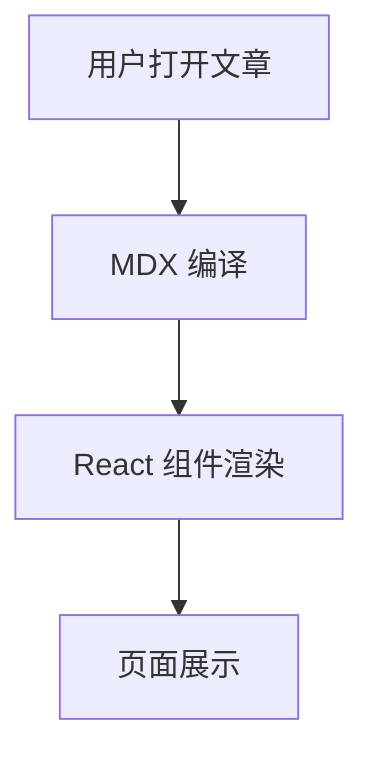

## 1. 文本基础能力

常用排版都可用：**加粗**、*斜体*、~~删除线~~、`行内代码`。

链接写法：

- 普通链接：[Vercel](https://vercel.com)
- 仓库链接：[GitHub](https://github.com)

> 一句话总结：能写文章，就能写出不错的阅读体验。

## 2. 列表、任务、表格（GFM）

### 任务清单

- [x] 标题、段落、引用
- [x] 代码块与语法高亮
- [x] Mermaid 图表
- [x] 数学公式
- [ ] 你自己的内容填充

### 表格

| 模块 | 语法 | 状态 |
| --- | --- | --- |
| 文本排版 | CommonMark | 已支持 |
| 表格/任务列表/脚注 | GFM | 已支持 |
| 数学公式 | KaTeX | 已支持 |
| Mermaid | 自定义插件 | 已支持 |
| MDX 组件 | React Components | 已支持 |

## 3. Alert 提示块

> [!NOTE]
> NOTE 适合补充信息，比如约定、背景、边界条件。

> [!TIP]
> TIP 适合实践建议，比如“推荐顺序”或“常见最佳实践”。

> [!WARNING]
> WARNING 适合提示潜在风险，例如误删、覆盖、兼容性问题。

> [!IMPORTANT]
> IMPORTANT 适合强调关键步骤，避免读者遗漏。

## 4. 代码块（高亮）

```ts
export type PostMeta = {
  title: string;
  date: string;
  tags: string[];
};

export function normalizeTags(tags: string[]) {
  return tags.map((tag) => tag.trim().toLowerCase()).filter(Boolean);
}
```

```bash
npm run dev
npm run lint
npm run build
```

```json
{
  "title": "Markdown 语法展示（花哨版）",
  "category": "技术",
  "draft": false
}
```

## 5. 数学公式（KaTeX）

行内公式：当 $a \ne 0$ 时，二次方程可以使用求根公式。

块级公式：

$$
x = \frac{-b \pm \sqrt{b^2 - 4ac}}{2a}
$$

再来一个常见求和式：

$$
\sum_{i=1}^{n} i = \frac{n(n+1)}{2}
$$

## 6. Mermaid 图表示例




## 7. 图片与脚注

图片（本站会渲染为可缩放图像）：


这是一句带脚注的文字[^mdx-note]。

[^mdx-note]: 脚注来自 GFM 能力，适合放补充说明或引用来源。

## 8. MDX 组件混排

先看新的 `:: + YAML` 写法（等价于 MDX JSX 组件调用）：

```md
::GitHubCalendarCard
username: lijiajunply
::
```

实际渲染效果：

::GitHubCalendarCard
username: lijiajunply
::

也支持复杂参数（对象 / 数组 / 布尔 / 数字）：

```md
::Icon
icon: ph:rocket-launch-duotone
className: text-emerald-500
::
```

::Icon
icon: ph:rocket-launch-duotone
className: text-emerald-500
::

::Card
className: my-8 border border-emerald-200/60 bg-gradient-to-r from-emerald-50/80 to-teal-50/80 p-6 dark:border-emerald-500/20 dark:from-emerald-900/20 dark:to-teal-900/20

---

### 组件化内容卡片

你可以把总结、提示、结果等信息放在这个区域，让页面结构更有层次。
::

图表类组件建议改用 `::` 分层块语法或独立数据源，本文先保留展示最常见的单组件调用。

## 9. 折叠内容与分隔线

<details>
  <summary>点我展开（原生 HTML 标签）</summary>
  <p>MDX 支持直接混用 HTML，你可以用它做补充说明区。</p>
</details>

---

如果你要继续扩展这篇展示文，建议优先增加你自己项目里会重复出现的“写作积木”，例如：FAQ 卡片、版本更新日志、统一的结语模板。
