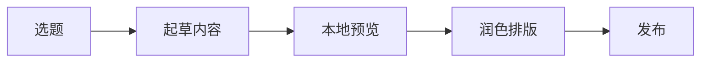
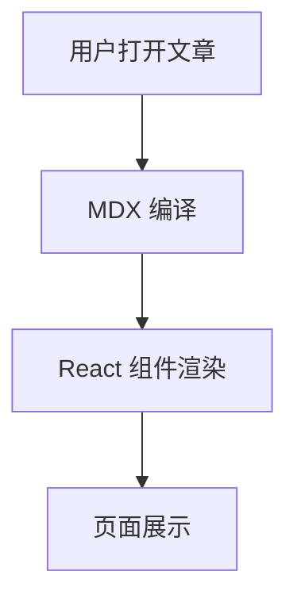

> 本篇由 AI 书写，因为我懒的写这个了

## 1. 文本基础能力

常用排版都可用：**加粗**、*斜体*、~~删除线~~、`行内代码`。

链接写法：

- 普通链接：[Vercel](https://vercel.com)
- 仓库链接：[GitHub](https://github.com)

> 还支持引用块，适合放一些补充说明、背景信息或者相关链接：

## 2. 列表、任务、表格（GFM）

### 任务清单

- [x] 标题、段落、引用
- [x] 代码块与语法高亮
- [x] Mermaid 图表
- [x] 数学公式
- [ ] 你自己的内容填充

### 表格

| 模块 | 语法 | 状态 |
| --- | --- | --- |
| 文本排版 | CommonMark | 已支持 |
| 表格/任务列表/脚注 | GFM | 已支持 |
| 数学公式 | KaTeX | 已支持 |
| Mermaid | 自定义插件 | 已支持 |
| MDX 组件 | React Components | 已支持 |

## 3. Alert 提示块

> [!NOTE]
> NOTE 适合补充信息，比如约定、背景、边界条件。

> [!TIP]
> TIP 适合实践建议，比如“推荐顺序”或“常见最佳实践”。

> [!WARNING]
> WARNING 适合提示潜在风险，例如误删、覆盖、兼容性问题。

> [!IMPORTANT]
> IMPORTANT 适合强调关键步骤，避免读者遗漏。

## 4. 代码块（高亮）

```ts
export type PostMeta = {
  title: string;
  date: string;
  tags: string[];
};

export function normalizeTags(tags: string[]) {
  return tags.map((tag) => tag.trim().toLowerCase()).filter(Boolean);
}
```

```bash
npm run dev
npm run lint
npm run build
```

```json
{
  "title": "Markdown 语法展示（花哨版）",
  "category": "技术",
  "draft": false
}
```

## 5. 数学公式（KaTeX）

行内公式：当 $a \ne 0$ 时，二次方程可以使用求根公式。

块级公式：

$$
x = \frac{-b \pm \sqrt{b^2 - 4ac}}{2a}
$$

再来一个常见求和式：

$$
\sum_{i=1}^{n} i = \frac{n(n+1)}{2}
$$

## 6. Mermaid 图表示例





## 7. 图片与脚注

图片（本站会渲染为可缩放图像）：


这是一句带脚注的文字[^mdx-note]。

[^mdx-note]: 脚注来自 GFM 能力，适合放补充说明或引用来源。

## 8. MDX 组件混排

先看看具体的语法

```md
::GitHubCalendarCard
username: lijiajunply
::
```

也就是形如 `::组件名` + `参数（YAML 格式）` + `::` 的结构，参数部分可以有多行，也可以没有。

### GitHub 贡献日历

GitHubCalendarCard 组件基于 react-github-calendar 封装，参数只需要提供 GitHub 用户名，就能展示对应的贡献日历：

```md
::GitHubCalendarCard
username: lijiajunply
::
```
实际渲染效果：

::GitHubCalendarCard
username: lijiajunply
::

### Icon 图标

Icon 使用 Iconify ，参数只需要提供图标名称（icon）和可选的样式类（className）：

```yaml
::Icon
icon: ph:rocket-launch-duotone
className: text-emerald-500
::
```

实际渲染效果：

::Icon
icon: ph:rocket-launch-duotone
className: text-emerald-500
::

### 内容卡片

这个就不用多说了，直接看语法和效果：

```yaml
::Card
className: my-8 border border-emerald-200/60 bg-gradient-to-r from-emerald-50/80 to-teal-50/80 p-6 dark:border-emerald-500/20 dark:from-emerald-900/20 dark:to-teal-900/20

---

### 组件化内容卡片

你可以把总结、提示、结果等信息放在这个区域，让页面结构更有层次。
::
```

实际渲染效果：

::Card
className: my-8 border border-emerald-200/60 bg-gradient-to-r from-emerald-50/80 to-teal-50/80 p-6 dark:border-emerald-500/20 dark:from-emerald-900/20 dark:to-teal-900/20

---

### 组件化内容卡片

你可以把总结、提示、结果等信息放在这个区域，让页面结构更有层次。
::

### 图表

这个就有点复杂了。整体是使用的 bklit UI ，语法上其实写起来有点坐牢，建议这部分直接拿 AI 帮忙写吧，毕竟参数比较多，层级也比较深：

```yaml
::AreaChart
data:
  - date: "2026-03-01"
    posts: 12
    tags: 8
  - date: "2026-03-02"
    posts: 15
    tags: 10
  - date: "2026-03-03"
    posts: 18
    tags: 11
  - date: "2026-03-04"
    posts: 16
    tags: 9
  - date: "2026-03-05"
    posts: 21
    tags: 14
  - date: "2026-03-06"
    posts: 25
    tags: 17
  - date: "2026-03-07"
    posts: 28
    tags: 20
margin:
  top: 12
  right: 12
  bottom: 24
  left: 12
aspectRatio: "16 / 7"
className: my-8 overflow-hidden rounded-2xl border border-neutral-200/70 bg-neutral-50/80 p-3 dark:border-neutral-700/60 dark:bg-neutral-900/50
---
::Grid
horizontal: true
numTicksRows: 4
::
::Area
dataKey: posts
fill: var(--chart-line-primary)
fillOpacity: 0.2
stroke: var(--chart-line-primary)
strokeWidth: 2
::
::Area
dataKey: tags
fill: var(--chart-line-secondary)
fillOpacity: 0.12
stroke: var(--chart-line-secondary)
strokeWidth: 2
::
::ChartTooltip
::
::XAxis
numTicks: 5
::
::
```

实际渲染效果：

::AreaChart
data:
  - date: "2026-03-01"
    posts: 12
    tags: 8
  - date: "2026-03-02"
    posts: 15
    tags: 10
  - date: "2026-03-03"
    posts: 18
    tags: 11
  - date: "2026-03-04"
    posts: 16
    tags: 9
  - date: "2026-03-05"
    posts: 21
    tags: 14
  - date: "2026-03-06"
    posts: 25
    tags: 17
  - date: "2026-03-07"
    posts: 28
    tags: 20
margin:
  top: 12
  right: 12
  bottom: 24
  left: 12
aspectRatio: "16 / 7"
className: my-8 overflow-hidden rounded-2xl border border-neutral-200/70 bg-neutral-50/80 p-3 dark:border-neutral-700/60 dark:bg-neutral-900/50
---
::Grid
horizontal: true
numTicksRows: 4
::
::Area
dataKey: posts
fill: var(--chart-line-primary)
fillOpacity: 0.2
stroke: var(--chart-line-primary)
strokeWidth: 2
::
::Area
dataKey: tags
fill: var(--chart-line-secondary)
fillOpacity: 0.12
stroke: var(--chart-line-secondary)
strokeWidth: 2
::
::ChartTooltip
::
::XAxis
numTicks: 5
::
::

### 聊天框

这里主要借鉴自 纸鹿 的对话框组件。但是纸鹿那个有点复杂，写起来也有点坐牢其实。这里我感觉支持一下一般情况就 ok 了，但如果你想要支持更多，直接去 Chat 组件那里改就行：

看看写法：

```yaml
::Chat
userChatData:
  - userName: ""
    messages: "你好，最近怎么样？"
  - userName: "NoName"
    messages: "挺好的，你呢？"
  - userName: "LuckyFish"
    messages: "我也不错。"
    isMe: true
::
```

看看效果：

::Chat
userChatData:
  - userName: ""
    messages: "你好，最近怎么样？"
  - userName: "NoName"
    messages: "挺好的，你呢？"
  - userName: "LuckyFish"
    messages: "我也不错。"
    isMe: true
::

### 点开内容

这里其实完全可以使用 HTML 的 details 标签来实现，但是我还是简单的支持一下：

语法是这样的，和其他组件的写法其实是不一样的：

```markdown
::details 点我展开
MDX 其实支持直接混用 HTML，但是我先支持一下
::

:: details [open] 已经展开了
MDX 其实支持直接混用 HTML，但是我先支持一下
::

```

::details 点我展开
MDX 其实支持直接混用 HTML，但是我先支持一下
::

:: details [open] 已经展开了
MDX 其实支持直接混用 HTML，但是我先支持一下
::

## 9. 原生 HTML 内容

因为 MDX 的特性，你可以直接在 Markdown 中混用 HTML 标签，这对于一些特殊需求的内容展示非常有用。

```html
<details>
  <summary>点我展开（原生 HTML 标签）</summary>
  <p>MDX 支持直接混用 HTML，你可以用它做补充说明区。</p>
</details>
```

<details>
  <summary>点我展开（原生 HTML 标签）</summary>
  <p>MDX 支持直接混用 HTML，你可以用它做补充说明区。</p>
</details>