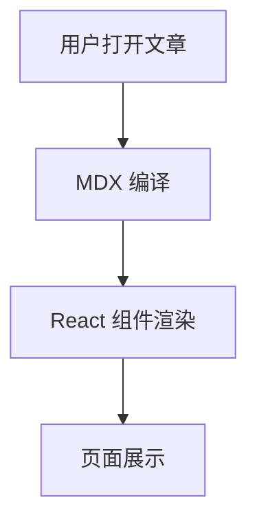

> 本篇部分由 AI 书写，因为我懒的写这个了

## 1. 文本基础能力

常用排版都可用：**加粗**、*斜体*、~~删除线~~、`行内代码`。

链接写法：

- 普通链接：[Vercel](https://vercel.com)
- 仓库链接：[GitHub](https://github.com)

> 还支持引用块，适合放一些补充说明、背景信息或者相关链接：

## 2. 列表、任务、表格（GFM）

### 任务清单

- [x] 标题、段落、引用
- [x] 代码块与语法高亮
- [x] Mermaid 图表
- [x] 数学公式
- [ ] 你自己的内容填充

### 表格

| 模块 | 语法 | 状态 |
| --- | --- | --- |
| 文本排版 | CommonMark | 已支持 |
| 表格/任务列表/脚注 | GFM | 已支持 |
| 数学公式 | KaTeX | 已支持 |
| Mermaid | 自定义插件 | 已支持 |
| MDX 组件 | React Components | 已支持 |

## 3. Alert 提示块

> [!NOTE]
> NOTE 适合补充信息，比如约定、背景、边界条件。

> [!TIP]
> TIP 适合实践建议，比如“推荐顺序”或“常见最佳实践”。

> [!WARNING]
> WARNING 适合提示潜在风险，例如误删、覆盖、兼容性问题。

> [!IMPORTANT]
> IMPORTANT 适合强调关键步骤，避免读者遗漏。

## 4. 代码块（高亮）

```ts
export type PostMeta = {
  title: string;
  date: string;
  tags: string[];
};

export function normalizeTags(tags: string[]) {
  return tags.map((tag) => tag.trim().toLowerCase()).filter(Boolean);
}
```

```bash
npm run dev
npm run lint
npm run build
```

```json
{
  "title": "Markdown 语法展示（花哨版）",
  "category": "技术",
  "draft": false
}
```

## 5. 数学公式（KaTeX）

行内公式：当 $a \ne 0$ 时，二次方程可以使用求根公式。

块级公式：

```markdown
$$
x = \frac{-b \pm \sqrt{b^2 - 4ac}}{2a}
$$
```

$$
x = \frac{-b \pm \sqrt{b^2 - 4ac}}{2a}
$$

再来一个常见求和式：

```markdown
$$
\sum_{i=1}^{n} i = \frac{n(n+1)}{2}
$$
```

$$
\sum_{i=1}^{n} i = \frac{n(n+1)}{2}
$$

## 6. Mermaid 图表示例




## 7. 图片与脚注

图片（本站会渲染为可缩放图像）：


这是一句带脚注的文字[^mdx-note]。

[^mdx-note]: 脚注来自 GFM 能力，适合放补充说明或引用来源。

## 8. 我自制的一些小组件

先看看具体的语法

```md
::GitHubCalendarCard
username: lijiajunply
::
```

也就是形如 `::组件名` + `参数（YAML 格式）` + `::` 的结构，参数部分可以有多行，也可以没有。

### GitHub 贡献日历

GitHubCalendarCard 组件基于 react-github-calendar 封装，参数只需要提供 GitHub 用户名，就能展示对应的贡献日历：

```md
::GitHubCalendarCard
username: lijiajunply
::
```
实际渲染效果：

::GitHubCalendarCard
username: lijiajunply
::

### Icon 图标

Icon 使用 Iconify ，参数只需要提供图标名称（icon）和可选的样式类（className）：

```yaml
::Icon
icon: ph:rocket-launch-duotone
className: text-emerald-500
::
```

实际渲染效果：

::Icon
icon: ph:rocket-launch-duotone
className: text-emerald-500
::

### 内容卡片

这个就不用多说了，直接看语法和效果：

```yaml
::Card
className: my-8 border border-emerald-200/60 bg-gradient-to-r from-emerald-50/80 to-teal-50/80 p-6 dark:border-emerald-500/20 dark:from-emerald-900/20 dark:to-teal-900/20

---

### 组件化内容卡片

你可以把总结、提示、结果等信息放在这个区域，让页面结构更有层次。
::
```

实际渲染效果：

::Card
className: my-8 border border-emerald-200/60 bg-gradient-to-r from-emerald-50/80 to-teal-50/80 p-6 dark:border-emerald-500/20 dark:from-emerald-900/20 dark:to-teal-900/20

---

### 组件化内容卡片

你可以把总结、提示、结果等信息放在这个区域，让页面结构更有层次。
::

### 图表

图表现在统一使用 `chart` 代码块 + JSON：

````markdown
```chart
{
  "type": "area",
  "title": "每周流量",
  "xKey": "date",
  "series": [
    { "key": "visitors", "label": "访客数", "color": "var(--chart-line-primary)" },
    { "key": "subscribers", "label": "订阅数", "color": "var(--chart-line-secondary)" }
  ],
  "data": [
    { "date": "2026-03-01", "visitors": 120, "subscribers": 44 },
    { "date": "2026-03-02", "visitors": 156, "subscribers": 52 },
    { "date": "2026-03-03", "visitors": 145, "subscribers": 58 },
    { "date": "2026-03-04", "visitors": 180, "subscribers": 61 },
    { "date": "2026-03-05", "visitors": 206, "subscribers": 74 },
    { "date": "2026-03-06", "visitors": 192, "subscribers": 71 },
    { "date": "2026-03-07", "visitors": 228, "subscribers": 83 }
  ]
}
```
````

实际渲染效果：

```chart
{
  "type": "area",
  "title": "每周流量",
  "xKey": "date",
  "series": [
    { "key": "visitors", "label": "访客数", "color": "var(--chart-line-primary)" },
    { "key": "subscribers", "label": "订阅数", "color": "var(--chart-line-secondary)" }
  ],
  "data": [
    { "date": "2026-03-01", "visitors": 120, "subscribers": 44 },
    { "date": "2026-03-02", "visitors": 156, "subscribers": 52 },
    { "date": "2026-03-03", "visitors": 145, "subscribers": 58 },
    { "date": "2026-03-04", "visitors": 180, "subscribers": 61 },
    { "date": "2026-03-05", "visitors": 206, "subscribers": 74 },
    { "date": "2026-03-06", "visitors": 192, "subscribers": 71 },
    { "date": "2026-03-07", "visitors": 228, "subscribers": 83 }
  ]
}
```

#### 饼图示例：

````markdown
```chart
{
  "type": "pie",
  "title": "渠道占比",
  "data": [
    { "name": "搜索", "value": 420, "color": "#2563eb" },
    { "name": "社媒", "value": 260, "color": "#7c3aed" },
    { "name": "外链", "value": 140, "color": "#db2777" }
  ]
}
```
````

实际渲染效果：

```chart
{
  "type": "pie",
  "title": "渠道占比",
  "data": [
    { "name": "搜索", "value": 420, "color": "#2563eb" },
    { "name": "社媒", "value": 260, "color": "#7c3aed" },
    { "name": "外链", "value": 140, "color": "#db2777" }
  ]
}
```

#### 雷达图示例：

````markdown
```chart
{
  "type": "radar",
  "title": "团队能力画像",
  "options": { "axisKey": "axis" },
  "series": [
    { "key": "frontend", "label": "前端", "color": "#2563eb" },
    { "key": "backend", "label": "后端", "color": "#7c3aed" }
  ],
  "data": [
    { "axis": "性能", "frontend": 82, "backend": 74 },
    { "axis": "稳定性", "frontend": 71, "backend": 88 },
    { "axis": "可维护性", "frontend": 76, "backend": 83 },
    { "axis": "交付速度", "frontend": 89, "backend": 79 },
    { "axis": "扩展性", "frontend": 73, "backend": 91 }
  ]
}
```
````

实际渲染效果：

```chart
{
  "type": "radar",
  "title": "团队能力画像",
  "options": { "axisKey": "axis" },
  "series": [
    { "key": "frontend", "label": "前端", "color": "#2563eb" },
    { "key": "backend", "label": "后端", "color": "#7c3aed" }
  ],
  "data": [
    { "axis": "性能", "frontend": 82, "backend": 74 },
    { "axis": "稳定性", "frontend": 71, "backend": 88 },
    { "axis": "可维护性", "frontend": 76, "backend": 83 },
    { "axis": "交付速度", "frontend": 89, "backend": 79 },
    { "axis": "扩展性", "frontend": 73, "backend": 91 }
  ]
}
```

#### 漏斗图示例：

````markdown
```chart
{
  "type": "funnel",
  "title": "转化漏斗",
  "data": [
    { "stage": "曝光", "value": 12000 },
    { "stage": "访问", "value": 4200 },
    { "stage": "注册", "value": 1280 },
    { "stage": "付费", "value": 360 }
  ]
}
```
````

实际渲染效果：

```chart
{
  "type": "funnel",
  "title": "转化漏斗",
  "data": [
    { "stage": "曝光", "value": 12000 },
    { "stage": "访问", "value": 4200 },
    { "stage": "注册", "value": 1280 },
    { "stage": "付费", "value": 360 }
  ]
}
```

#### 桑基图示例：

````markdown
```chart
{
  "type": "sankey",
  "title": "用户流向",
  "nodes": [
    { "id": "ad", "label": "广告" },
    { "id": "search", "label": "搜索" },
    { "id": "landing", "label": "落地页" },
    { "id": "signup", "label": "注册" },
    { "id": "paid", "label": "付费" }
  ],
  "links": [
    { "source": "ad", "target": "landing", "value": 380 },
    { "source": "search", "target": "landing", "value": 520 },
    { "source": "landing", "target": "signup", "value": 340 },
    { "source": "landing", "target": "paid", "value": 110 },
    { "source": "signup", "target": "paid", "value": 160 }
  ]
}
```
````

实际渲染效果：

```chart
{
  "type": "sankey",
  "title": "用户流向",
  "nodes": [
    { "id": "ad", "label": "广告" },
    { "id": "search", "label": "搜索" },
    { "id": "landing", "label": "落地页" },
    { "id": "signup", "label": "注册" },
    { "id": "paid", "label": "付费" }
  ],
  "links": [
    { "source": "ad", "target": "landing", "value": 380 },
    { "source": "search", "target": "landing", "value": 520 },
    { "source": "landing", "target": "signup", "value": 340 },
    { "source": "landing", "target": "paid", "value": 110 },
    { "source": "signup", "target": "paid", "value": 160 }
  ]
}
```

#### Choropleth 示例（内置地图，真实 TopoJSON 边界）：

````markdown
```chart
{
  "type": "choropleth",
  "title": "地区热度（中国省级）",
  "mapId": "china-provinces",
  "data": [
    { "featureId": "guangdong", "value": 860 },
    { "featureId": "zhejiang", "value": 720 },
    { "featureId": "jiangsu", "value": 650 },
    { "featureId": "sichuan", "value": 540 },
    { "featureId": "beijing", "value": 480 }
  ]
}
```
````

实际渲染效果：

```chart
{
  "type": "choropleth",
  "title": "地区热度（中国省级）",
  "mapId": "china-provinces",
  "data": [
    { "featureId": "guangdong", "value": 860 },
    { "featureId": "zhejiang", "value": 720 },
    { "featureId": "jiangsu", "value": 650 },
    { "featureId": "sichuan", "value": 540 },
    { "featureId": "beijing", "value": 480 }
  ]
}
```

`featureId` 支持混用省份拼音、中文名和区划码：

````markdown
```chart
{
  "type": "choropleth",
  "title": "地区热度（中国别名匹配）",
  "mapId": "china-provinces",
  "data": [
    { "featureId": "Beijing", "value": 520 },
    { "featureId": "广东省", "value": 900 },
    { "featureId": "320000", "value": 680 },
    { "featureId": "Sichuan", "value": 610 },
    { "featureId": "Zhejiang", "value": 740 }
  ]
}
```
````

实际渲染效果：

```chart
{
  "type": "choropleth",
  "title": "地区热度（中国别名匹配）",
  "mapId": "china-provinces",
  "data": [
    { "featureId": "Beijing", "value": 520 },
    { "featureId": "广东省", "value": 900 },
    { "featureId": "320000", "value": 680 },
    { "featureId": "Sichuan", "value": 610 },
    { "featureId": "Zhejiang", "value": 740 }
  ]
}
```

世界地图示例（支持国家名称和 ISO 数字代码）：

````markdown
```chart
{
  "type": "choropleth",
  "title": "全球热度（国家）",
  "mapId": "world-countries",
  "data": [
    { "featureId": "China", "value": 980 },
    { "featureId": "United States of America", "value": 860 },
    { "featureId": "356", "value": 780 },
    { "featureId": "392", "value": 620 },
    { "featureId": "Germany", "value": 590 }
  ]
}
```
````

实际渲染效果：

```chart
{
  "type": "choropleth",
  "title": "全球热度（国家）",
  "mapId": "world-countries",
  "data": [
    { "featureId": "China", "value": 980 },
    { "featureId": "United States of America", "value": 860 },
    { "featureId": "356", "value": 780 },
    { "featureId": "392", "value": 620 },
    { "featureId": "Germany", "value": 590 }
  ]
}
```

### 聊天框

这里主要借鉴自 纸鹿 的对话框组件。但是纸鹿那个有点复杂，写起来也有点坐牢其实。这里我感觉支持一下一般情况就 ok 了，但如果你想要支持更多，直接去 Chat 组件那里改就行：

看看写法：

```yaml
::Chat
data:
  - userName: ""
    messages: "你好，最近怎么样？"
  - userName: "NoName"
    messages: "挺好的，你呢？"
  - userName: "LuckyFish"
    messages: "我也不错。"
    isMe: true
::
```

看看效果：

::Chat
data:
  - userName: ""
    messages: "你好，最近怎么样？"
  - userName: "NoName"
    messages: "挺好的，你呢？"
  - userName: "LuckyFish"
    messages: "我也不错。"
    isMe: true
::

### 点开内容

这里其实完全可以使用 HTML 的 details 标签来实现，但是我还是简单的支持一下：

语法是这样的，和其他组件的写法其实是不一样的：

```markdown
::details 点我展开
MDX 其实支持直接混用 HTML，但是我先支持一下
::

:: details [open] 已经展开了
MDX 其实支持直接混用 HTML，但是我先支持一下
::

```

::details 点我展开
MDX 其实支持直接混用 HTML，但是我先支持一下
::

:: details [open] 已经展开了
MDX 其实支持直接混用 HTML，但是我先支持一下
::

### 链接卡片

```markdown
::LinkCard
icon: https://picsum.photos/100/100
title: 标题
description: 这是一行描述，如果不提供描述会展示域名
url: https://blog.luckyfishes.site/
::
```

::LinkCard
icon: https://picsum.photos/100/100
title: 标题
description: 这是一行描述，如果不提供描述会展示域名
url: https://blog.luckyfishes.site/
::

其实就有点像知乎的那个链接小卡片了

## 9. 乐谱

是这样的，我加入了乐谱的支持：

````markdown
```music
L:1/8
Q:1/4=100
M:2/4
K:D
V:1 clef=treble
V:2 clef=bass
%%MIDI program 32
[V:1] z2 z f/g/ | aa a>b | af dd/e/ | ff ee | d2 z2 || FA A>B | AF DD/E/ |
w: | | | | | 你 爱 我 | 我 爱 你 蜜 雪
[V:2] z4 | D,[F,A,] .A,[F,A,] | .D,[F,A,] .A,[E,A,] | .G,,[G,D,] .A,,[E,A,] | .D,[F,A,] [D,,D,]2 || .D,,[D,F,] .A,,[D,F,] | .D,,[D,F,] .A,,[D,F,] |
[V:1] FF ED | E2 z2 | FA A>B | AF DD/E/ | FF EE | D2 z2 | G2 G2 |
w: 冰 城 甜 蜜 | 蜜 | 你 爱 我 | 我 爱 你 蜜 雪 冰 城 甜 蜜 | 蜜 | 你 爱
[V:2] .G,,[B,G,] .D,[B,G,] | .A,,[A,C] .E,[A,C] | .D,,[D,F,] .A,,[D,F,] | .D,,[D,F,] .A,,[D,F,] | .G,,[G,D,] .A,,[E,A,] | .D,,[A,,D,] .[A,,D,]2 | .G,,[B,G,] .D,[B,G,] |
[V:1] GB z2 | A2 AF | E2 z2 | FA A>B | AF DD/E/ | FF EE | D2 z2 |]
w: 我 呀 | 我 爱 | 你 | 你 爱 我 | 我 爱 你 蜜 雪 冰 城 甜 蜜 | 蜜
[V:2] .G,,[B,G,] .D,[B,G,] | .D,,[F,D,] .A,,[F,D,] | .A,,[A,C] .E,[A,C] | .D,,[F,D,] .A,,[F,D,] | .D,,[F,D,] .A,,[F,D,] | .G,,[G,D,] .A,,[E,A,] | .D,.A,, [D,,D,]2 |]
```
````

渲染效果：

```music
L:1/8
Q:1/4=100
M:2/4
K:D
V:1 clef=treble
V:2 clef=bass
%%MIDI program 32
[V:1] z2 z f/g/ | aa a>b | af dd/e/ | ff ee | d2 z2 || FA A>B | AF DD/E/ |
w: | | | | | 你 爱 我 | 我 爱 你 蜜 雪
[V:2] z4 | D,[F,A,] .A,[F,A,] | .D,[F,A,] .A,[E,A,] | .G,,[G,D,] .A,,[E,A,] | .D,[F,A,] [D,,D,]2 || .D,,[D,F,] .A,,[D,F,] | .D,,[D,F,] .A,,[D,F,] |
[V:1] FF ED | E2 z2 | FA A>B | AF DD/E/ | FF EE | D2 z2 | G2 G2 |
w: 冰 城 甜 蜜 | 蜜 | 你 爱 我 | 我 爱 你 蜜 雪 冰 城 甜 蜜 | 蜜 | 你 爱
[V:2] .G,,[B,G,] .D,[B,G,] | .A,,[A,C] .E,[A,C] | .D,,[D,F,] .A,,[D,F,] | .D,,[D,F,] .A,,[D,F,] | .G,,[G,D,] .A,,[E,A,] | .D,,[A,,D,] .[A,,D,]2 | .G,,[B,G,] .D,[B,G,] |
[V:1] GB z2 | A2 AF | E2 z2 | FA A>B | AF DD/E/ | FF EE | D2 z2 |]
w: 我 呀 | 我 爱 | 你 | 你 爱 我 | 我 爱 你 蜜 雪 冰 城 甜 蜜 | 蜜
[V:2] .G,,[B,G,] .D,[B,G,] | .D,,[F,D,] .A,,[F,D,] | .A,,[A,C] .E,[A,C] | .D,,[F,D,] .A,,[F,D,] | .D,,[F,D,] .A,,[F,D,] | .G,,[G,D,] .A,,[E,A,] | .D,.A,, [D,,D,]2 |]
```

## 10. 原生 HTML 内容

因为 MDX 的特性，你可以直接在 Markdown 中混用 HTML 标签，这对于一些特殊需求的内容展示非常有用。

```html
<details>
  <summary>点我展开（原生 HTML 标签）</summary>
  <p>MDX 支持直接混用 HTML，你可以用它做补充说明区。</p>
</details>
```

<details>
  <summary>点我展开（原生 HTML 标签）</summary>
  <p>MDX 支持直接混用 HTML，你可以用它做补充说明区。</p>
</details>

## 11. 选项卡 (Tabs)

现在支持使用 ` ```tab ` 代码块语法。这种方式比直接写 MDX 组件更简洁，且对 Markdown 编辑器更友好。

### 基础用法

语法规则：
1. 第一段为 YAML 配置，使用 `tabs: ["标签1", "标签2"]` 定义标签。
2. 使用 `---` 分隔配置与内容，以及分隔不同的选项卡内容。

````markdown
```tab
tabs: ["苹果", "橘子"]
---
这是一个关于苹果的内容。支持 **Markdown**。
---
这是一个关于橘子的内容。
```
````

实际渲染效果：

```tab
tabs: ["苹果", "橘子"]
---
这是一个关于苹果的内容。支持 **Markdown**。
---
这是一个关于橘子的内容。
```

### 左右对照（多语言/工具示例）

这是一个典型的多包管理器命令对照示例，演示了如何在 Tab 中嵌套代码块：

````markdown
```tab
tabs: ["pnpm", "npm", "yarn"]
---
```bash
pnpm add lucide-react
```
---
```bash
npm install lucide-react
```
---
```bash
yarn add lucide-react
```
```
````

实际渲染效果：

```tab
tabs: ["pnpm", "npm", "yarn"]
---
```bash
pnpm add lucide-react
```
---
```bash
npm install lucide-react
```
---
```bash
yarn add lucide-react
```
```


## 最后

剩下的我慢慢加，特此感谢纸鹿大佬开源，这里很多组件都是借鉴的纸鹿大佬的。虽然纸鹿大佬的组件语法有些我个人感觉写着有点小麻烦，但不得不说效果，样式都非常不错。